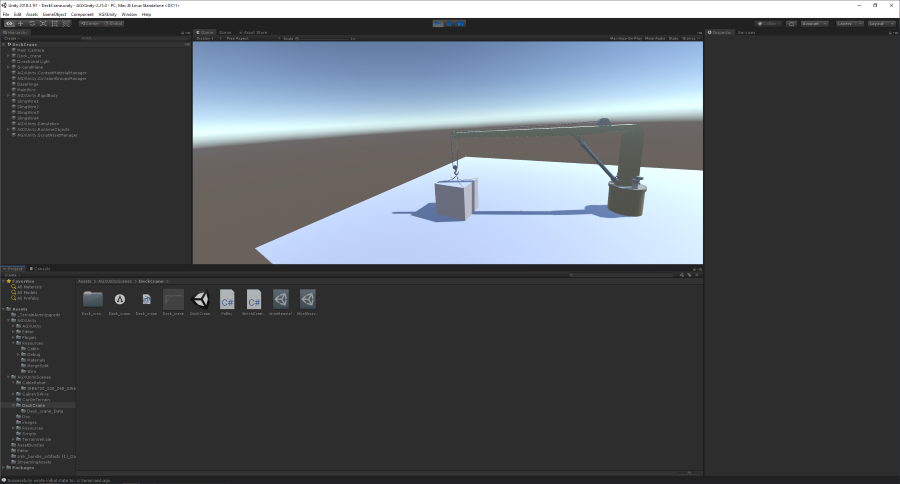
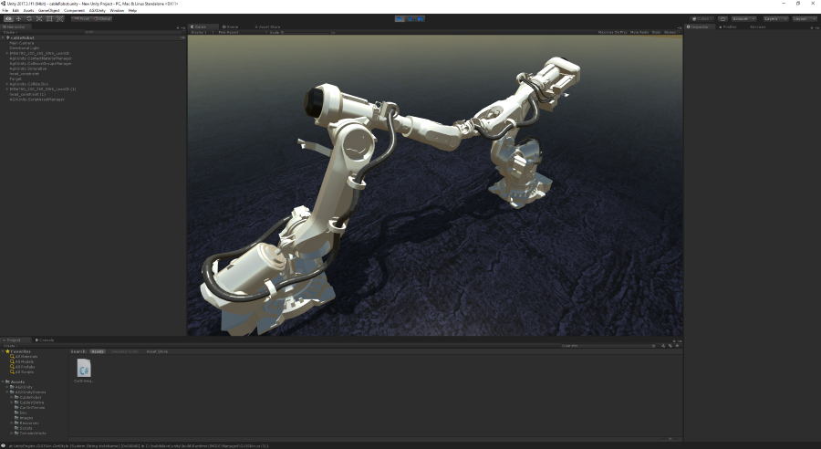
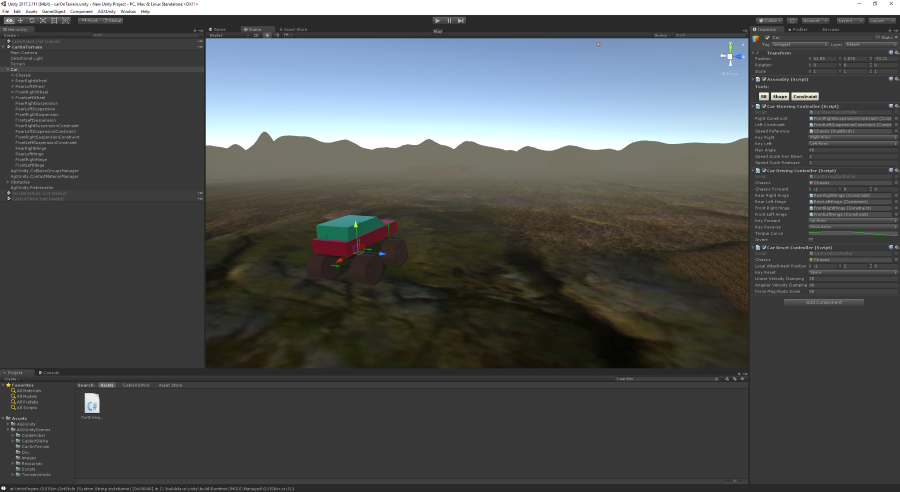
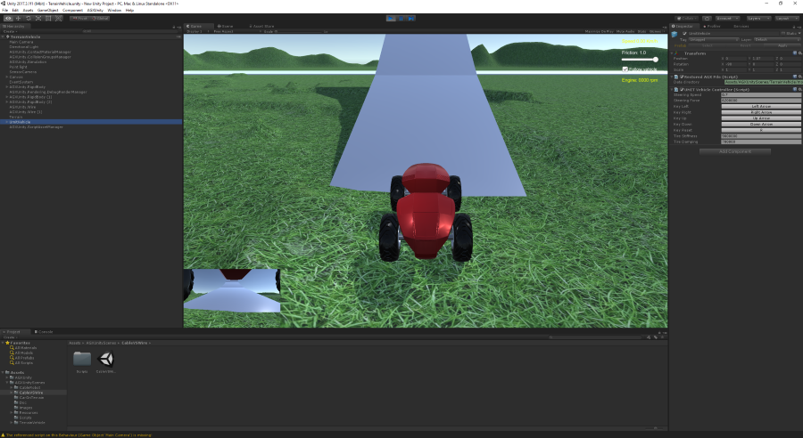
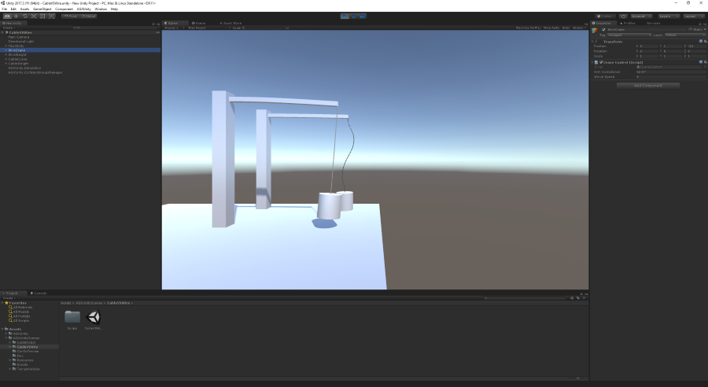
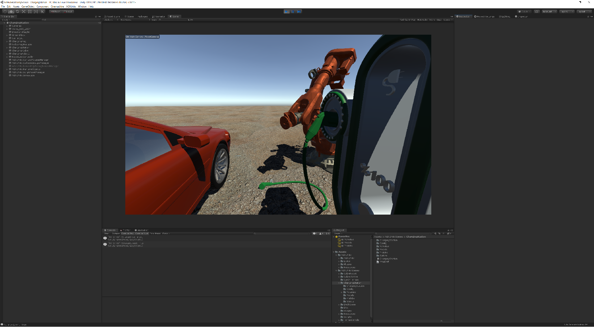

# AGXUnityScenes
This project contains sample scenes using AGXUnity and AGX Dynamics in Unity3D.
Please go ahead and use them as you like. 

## Installing
To use these scenes you need to do the following:

1. Create a new empty project
2. In the project-directory `Assets` clone/unzip the [AGXUnity project](https://github.com/Algoryx/AGXUnity). Now you should have `<your-project>\Assets\AGXUnity`
3. Install AGX Dynamics from [Algoryx Simulation](https://www.algoryx.se/products/agx-dynamics/) on your computer. 
4. Copy the AGXDotNet.dll file from the AGX Dynamics installation directory (`<agx-dir>\bin\x64`) into `<your-project>\Assets\AGXDotNet\plugins\x64_86`
5. Next, clone/unzip this (AGXUnityScenes) project into the `Assets` directory. Now you should also have the following structure: `<your-project>\Assets\AGXUnityScenes`
6. When all scripts are compiled, locate the sample scenes in the `Assets\AGXUnityScenes\` sub-directory and drag them from the Project to the Hiearchy.
7. Done.

## DeckCrane

This scene is part of the tutorial [Modelling a crane with wires](https://www.youtube.com/watch?v=YNEDk1417iM&feature=youtu.be). It show the workflow of modelling a complete crane system starting from a CAD model. It utilizes [Algoryx Momentum](https://www.algoryx.se/products/algoryx-momentum/) for the modelling of the crane parts including dynamic properties such as joints, materials, rigid bodies and collision shapes. 

## CableRobot

This scene demonstrate the use of `agxCable::Cable` class for simulating a flexible cable attached to two industrial robots.

## carOnTerrain

This scene show a vehicle which can be controlled using keyboards (left/right/up/down).

## TerrainVehicle

This scene demonstrates another vehicle, this time powered using the Drivetrain API including Engine, Clutch, GearBox and Differential.
Control the vehicle using the keyboard (left/right/up/down).

## CableVSWire

To illustrate an important difference between the `agxCable::Cable` class and the `agxWire::Wire` class this scene show two similar scenarios where one is using 
the Cable and the other using the Wire class. Notice that the one using a Wire is perfectly stable, even under high loads.
You can change the mass of the WireWeight rigid body to see how the wire reacts even under very high loads.

Also, the crane arm is flexible, using a number of rigid bodies, locked to each other using LockJoints. The compliance (stiffness) of the LockJoints can
be set using the editor when running the simulation.

Also, the winch in the wire crane can be operated using the same property editor.

This does not mean that the Cable *does not work* it just means that it behaves as expected from a lumped element model under high tension. The `agxCable::Cable` class is excellent for modelling hoses, ropes, hydraulic pipes etc where you do not have a high load compared to the individual mass elements in the discretized cable model.

The `agx::Wire` class on the other hand is a different beast that can cope with extremely high load, still it has a realistic interaction with surrounding geometries, including contact friction...

## ChargingStation

This is a sketch of a robot attaching a charging cable to an electric vehicle. It showcases one of new types of quadratic colliders - the hollow cone, in addition to being a general demo of simple keyboard control of a robot. Control the robot using keyboard commands detailed in the Readme file in the scene folder.

This scene requires an AGX version of 2.27.1.0 or newer in order to use the charging socket hollow cone colliders.

*Note:* this scene uses the Unity3D package CineMachine for camera control. The package is available from the Unity Package Manager starting with Unity versions 2018.X and up. The references to this package can be stripped out if desired.